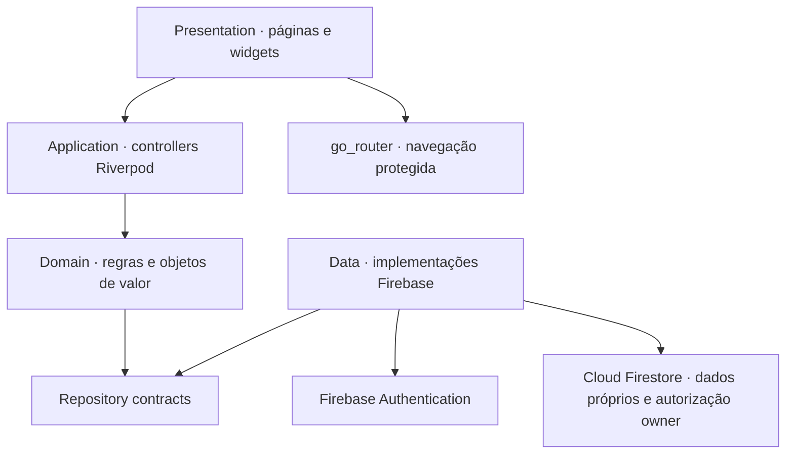

<div align="center">

# Meu Gestor Financeiro

**Clareza hoje para decisões financeiras melhores amanhã.**

Em desenvolvimento · Flutter/Dart · Android · Arquitetura limpa e modular

[](https://flutter.dev/)
[](https://dart.dev/)
[](https://developer.android.com/)
[](https://firebase.google.com/)
[](LICENSE)
[](https://github.com/danilo-programadorr/Meu-Gestor/actions/workflows/quality.yml)

</div>

## Sobre o projeto

O Meu Gestor Financeiro é um aplicativo de organização financeira pessoal. Seu objetivo é reunir rendas, contas a pagar e receber, despesas, dívidas, vencimentos, projeções, metas e planejamento em uma experiência simples para quem não domina termos contábeis.

O projeto está em construção incremental. A fundação, a autenticação Android e o núcleo financeiro manual já existem; os módulos financeiros avançados permanecem no roadmap e não devem ser interpretados como funcionalidades concluídas.

> O projeto oferece ferramentas de organização financeira e não substitui contador, consultor financeiro, advogado ou outro profissional regulamentado.

## Estado atual

Concluído e validado localmente:

- fundação Flutter para Android;
- arquitetura modular por funcionalidades;
- tema claro, tema escuro e sistema visual responsivo;
- autenticação por e-mail e senha;
- criação de conta, confirmação de e-mail e recuperação de senha;
- login Google;
- rotas protegidas por autenticação e confirmação de e-mail;
- integração Firebase Android para ambiente de desenvolvimento;
- perfil e consentimentos aprovados no fluxo Android;
- contas e carteiras implementadas localmente com saldo inicial, total, edição, arquivamento e restauração;
- categorias e lançamentos manuais de receitas/despesas implementados localmente;
- saldo atual e resumo mensal derivados em centavos inteiros, sem saldo materializado;
- filtros por tipo, conta e categoria, além de edição descritiva e cancelamento irreversível de lançamentos;
- contas a pagar e receber com atraso derivado, liquidação/anulação atômicas e vínculo bidirecional ao lançamento;
- dashboard analítico responsivo com filtros locais, indicadores reais, gráficos acessíveis e menu agrupado;
- acompanhamento manual local de ações e fundos imobiliários por carteiras, compras e vendas, sem alterar o saldo;
- proventos manuais previstos, recebidos, cancelados ou anulados, com dividendos, JCP e rendimentos de FII separados do núcleo financeiro;
- acesso owner seguro, confirmado pelo servidor, com Área do proprietário e revalidação;
- capabilities preparadas para futuros recursos de assinatura, funcionalidades pagas e IA;
- entitlement Premium com domínio puro, backend SUB-1B local, enforcement SUB-1C e preparação local SUB-1D/SUB-1E-1 para um produto Google Play com planos-base; ainda sem cobrança, compra ou paywall real;
- regras Firestore publicadas em development com isolamento por UID, campos fechados e negação por padrão;
- testes unitários, de widgets, integração de fluxos e segurança estrutural.

Limites atuais:

- não existem ambiente de produção, assinatura real, cobrança, paywall, produto criado no Play Console, entitlement no Firebase real, backend implantado, Google Play Billing ativo, Stripe ou Mercado Pago;
- não existem consumo real de IA, transferências, cartões, faturas, recorrências ou parcelamentos;
- investimentos não possuem cotação, integração com corretora, Open Finance, agenda automática de proventos, cálculo tributário ou recomendação;
- notificações, relatórios completos, projeções e integração Open Finance ainda não foram implementados;
- os documentos jurídicos presentes são provisórios e exclusivos de desenvolvimento;
- não existe versão de produção publicada.

## Diferenciais planejados

O roadmap inclui linha do tempo do saldo, projeções financeiras, recurso “Posso comprar?”, simulador de cenários, alertas, orçamentos, metas, estratégias para dívidas, plano anticrise e assistência financeira com IA explicável. Esses recursos são planejamento, não estado atual do produto.

## Arquitetura



As dependências apontam para o domínio. Widgets não acessam Firebase diretamente, e valores monetários são representados por objetos de valor baseados em centavos inteiros.

## Estrutura resumida

```text
lib/
  app/
  core/
  features/
    authentication/
    accounts/
    categories/
    home/
    investments/
    owner_access/
    privacy/
    profile/
    subscriptions/
    transactions/
assets/
test/
docs/
android/
```

## Sistema visual

| Token | Cor | Finalidade |
|---|---:|---|
| `backgroundPrimary` | `#040A1A` | fundo escuro principal |
| `backgroundSecondary` | `#081129` | fundo escuro secundário |
| `backgroundElevated` | `#0C2237` | elevação e fallback |
| `surfacePrimary` | `#18203E` | campos e cartões |
| `primaryCyan` | `#17CFFF` | foco e destaque |
| `primaryBlue` | `#2F80ED` | ações e gradientes |
| `positiveGreen` | `#74BA76` | confirmação positiva |
| `secondaryPurple` | `#7447E8` | apoio visual |
| `errorRed` | `#FF6B7A` | erro com texto e ícone |
| `textPrimary` | `#F0F6FC` | texto principal escuro |
| `textSecondary` | `#92A8BB` | texto auxiliar escuro |

Estados importantes combinam cor, texto, ícone e semântica. As imagens usadas como referência de design não fazem parte do repositório público.

## Como executar

### Requisitos

- Flutter 3.41.1;
- Dart 3.11.0;
- Android SDK;
- Java 21, preferencialmente o JBR fornecido pelo Android Studio;
- um projeto Firebase próprio para desenvolvimento.

Cada desenvolvedor deve registrar seu aplicativo Android no próprio Firebase, cadastrar as impressões SHA necessárias e colocar sua configuração exclusivamente local em `android/app/google-services.json`. O arquivo não está presente no repositório e nunca deve ser publicado. Consulte [Configuração Firebase local](docs/CONFIGURACAO_FIREBASE_LOCAL.md).

No PowerShell, execute cada comando separadamente:

```powershell
flutter pub get
flutter analyze
flutter test
flutter run --dart-define=APP_ENV=development
```

O ambiente `production` permanece bloqueado até possuir configuração própria e documentos jurídicos oficiais.

## Testes

A suíte atual cobre:

- inicialização do aplicativo e proteção de ambiente;
- autenticação, validação e rotas protegidas;
- login Google e diagnóstico sanitizado;
- perfil, consentimentos e portões jurídicos;
- contas, categorias, lançamentos, saldo derivado e resumo mensal;
- compromissos financeiros e vínculos atômicos;
- investimentos manuais, aritmética escalada, custo médio, concorrência e anulação encadeada;
- acesso owner, capabilities, revogação e falha fechada;
- entitlement Premium puro, períodos, decisões de acesso, preservação de dados e transições por revisão;
- telas pequenas, teclado e aumento de fonte;
- temas, contraste, semântica e acessibilidade;
- dinheiro em centavos, operações aritméticas e formatação BRL.

O workflow [Qualidade](.github/workflows/quality.yml) executa formatação, análise estática e testes em pushes e pull requests direcionados à `main`.

## Segurança

- segredos e configurações Firebase são exclusivamente locais;
- nenhuma senha é armazenada pelo aplicativo;
- diagnósticos de autenticação não registram tokens, e-mails ou credenciais;
- ambientes de desenvolvimento e produção são separados;
- valores monetários são persistidos em centavos inteiros;
- o Firestore aplica regras restritivas, campos fechados e isolamento por usuário.

Para reportar uma vulnerabilidade, siga [SECURITY.md](SECURITY.md) e não publique credenciais em issues.

### Acesso proprietário em development

O projeto possui uma arquitetura de acesso proprietário baseada exclusivamente no UID autenticado e no documento protegido `system_admins/{uid}`. O cliente consulta somente o próprio documento, exige confirmação do servidor e não pode criar, editar, excluir ou listar administradores. Nenhum e-mail, UID, senha ou preferência local concede privilégios.

O papel `owner` recebe capabilities centralizadas para módulos implementados, recursos experimentais e futuros recursos comerciais ou de IA. Esse bypass de produto nunca ignora Security Rules, isolamento por UID, validações financeiras, autenticação ou limites técnicos de segurança. Consulte [Acesso proprietário](docs/architecture/ACESSO_PROPRIETARIO.md).

## Roadmap

- [x] Fundação Flutter
- [x] Sistema visual
- [x] Autenticação Firebase
- [x] Login Google
- [x] Perfil e consentimentos persistidos
- [x] Contas e carteiras
- [x] Categorias, receitas e despesas ocorridas
- [x] Acesso proprietário seguro em development
- [x] Contas a pagar e receber
- [x] Dashboard
- [x] Acompanhamento manual de ações e FIIs
- [x] Proventos manuais
- [x] Domínio e contrato de entitlement Premium (sem cobrança ou paywall)
- [x] Backend development local e leitura do entitlement; regras publicadas somente em development
- [x] Enforcement Premium local e modo somente leitura em investimentos (regras ainda não publicadas)
- [-] SUB-1D/SUB-1E-1: experiência e catálogo local Google Play preparados para um produto único; backend real e cobrança continuam bloqueados
- [ ] Cotações atrasadas por provedor independente, condicionadas a licenciamento e SUB-1
- [ ] Projeções
- [ ] Cartões e faturas
- [ ] Dívidas
- [ ] Orçamentos e metas
- [ ] Notificações
- [ ] Relatórios
- [ ] Gemini e plano anticrise
- [ ] Produção

## Contribuição

Contribuições devem respeitar a especificação funcional, as decisões arquiteturais e os controles de privacidade do projeto. Leia [CONTRIBUTING.md](CONTRIBUTING.md) antes de abrir uma pull request.

## Licença

Distribuído sob a licença [MIT](LICENSE).

---

<div align="center">
Construído de forma incremental, verificável e orientada à segurança.
</div>

## SUB-1D/SUB-1E-1 — Google Play Billing preparado localmente

O mesmo checkpoint do SUB-1C inclui a página **Premium e assinatura**, acessível por Menu, Perfil e pela tela negada de investimentos. Há contratos de catálogo, compra, restauração, verificação, disponibilidade e gerenciamento externo. `in_app_purchase` 3.3.0 e `url_launcher` 6.3.2 são plugins mantidos pelo Flutter.

O catálogo comercial aprovado tem o produto único `meu_gestor_premium`, planos-base `mensal` e `anual` e oferta `teste-3d` somente no mensal. Brasil é o país inicial; R$ 19,90/mês e R$ 209,90/ano são valores para configuração futura no Play Console. A interface exibe preço, moeda, elegibilidade e detalhes apenas quando a Play Store os devolver. Sem catálogo real, backend verificador e App Check preparado, mostra “Assinaturas em preparação” e nenhuma cobrança é iniciada.

Resposta local de compra nunca concede Premium: exige verificação de backend e releitura confirmada do entitlement. Não foram criados produtos Play, grants reais ou regras SUB-1E publicadas. Existem apenas três callables de bootstrap em development, republicadas com Node 22 e ainda fechadas para compra/restauração; o artefato de produção omite dependências opcionais e sua auditoria não encontrou vulnerabilidades. O núcleo financeiro permanece gratuito; investimentos manuais e proventos permanecem Premium. A margem líquida não é prometida: dependerá de taxa Play, impostos, reembolsos e custos Cloud reais.
