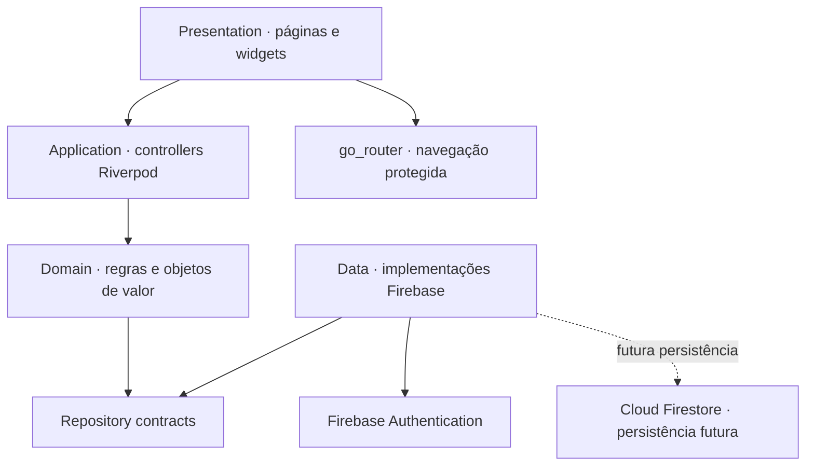

<div align="center">

# Meu Gestor Financeiro

**Clareza hoje para decisões financeiras melhores amanhã.**

Em desenvolvimento · Flutter/Dart · Android · Arquitetura limpa e modular

[](https://flutter.dev/)
[](https://dart.dev/)
[](https://developer.android.com/)
[](https://firebase.google.com/)
[](LICENSE)
[](https://github.com/danilo-programadorr/Meu-Gestor/actions/workflows/quality.yml)

</div>

## Sobre o projeto

O Meu Gestor Financeiro é um aplicativo de organização financeira pessoal. Seu objetivo é reunir rendas, contas a pagar e receber, despesas, dívidas, vencimentos, projeções, metas e planejamento em uma experiência simples para quem não domina termos contábeis.

O projeto está em construção incremental. A fundação e a autenticação Android já existem; os módulos financeiros avançados permanecem no roadmap e não devem ser interpretados como funcionalidades concluídas.

> O projeto oferece ferramentas de organização financeira e não substitui contador, consultor financeiro, advogado ou outro profissional regulamentado.

## Estado atual

Concluído e validado localmente:

- fundação Flutter para Android;
- arquitetura modular por funcionalidades;
- tema claro, tema escuro e sistema visual responsivo;
- autenticação por e-mail e senha;
- criação de conta, confirmação de e-mail e recuperação de senha;
- login Google;
- rotas protegidas por autenticação e confirmação de e-mail;
- integração Firebase Android para ambiente de desenvolvimento;
- testes unitários e de widgets;
- geração local de APK debug.

Limites atuais:

- o Firestore não realiza leituras ou gravações financeiras;
- os módulos de contas, rendas, despesas e projeções ainda não foram implementados;
- os documentos jurídicos presentes são provisórios e exclusivos de desenvolvimento;
- não existe versão de produção publicada.

## Diferenciais planejados

O roadmap inclui linha do tempo do saldo, projeções financeiras, recurso “Posso comprar?”, simulador de cenários, alertas, orçamentos, metas, estratégias para dívidas, plano anticrise e assistência financeira com IA explicável. Esses recursos são planejamento, não estado atual do produto.

## Arquitetura



As dependências apontam para o domínio. Widgets não acessam Firebase diretamente, e valores monetários são representados por objetos de valor baseados em centavos inteiros.

## Estrutura resumida

```text
lib/
  app/
  core/
  features/
    authentication/
    home/
    privacy/
assets/
test/
docs/
android/
```

## Sistema visual

| Token | Cor | Finalidade |
|---|---:|---|
| `backgroundPrimary` | `#040A1A` | fundo escuro principal |
| `backgroundSecondary` | `#081129` | fundo escuro secundário |
| `backgroundElevated` | `#0C2237` | elevação e fallback |
| `surfacePrimary` | `#18203E` | campos e cartões |
| `primaryCyan` | `#17CFFF` | foco e destaque |
| `primaryBlue` | `#2F80ED` | ações e gradientes |
| `positiveGreen` | `#74BA76` | confirmação positiva |
| `secondaryPurple` | `#7447E8` | apoio visual |
| `errorRed` | `#FF6B7A` | erro com texto e ícone |
| `textPrimary` | `#F0F6FC` | texto principal escuro |
| `textSecondary` | `#92A8BB` | texto auxiliar escuro |

Estados importantes combinam cor, texto, ícone e semântica. As imagens usadas como referência de design não fazem parte do repositório público.

## Como executar

### Requisitos

- Flutter 3.41.1;
- Dart 3.11.0;
- Android SDK;
- Java 21, preferencialmente o JBR fornecido pelo Android Studio;
- um projeto Firebase próprio para desenvolvimento.

Cada desenvolvedor deve registrar seu aplicativo Android no próprio Firebase, cadastrar as impressões SHA necessárias e colocar sua configuração exclusivamente local em `android/app/google-services.json`. O arquivo não está presente no repositório e nunca deve ser publicado. Consulte [Configuração Firebase local](docs/CONFIGURACAO_FIREBASE_LOCAL.md).

No PowerShell, execute cada comando separadamente:

```powershell
flutter pub get
flutter analyze
flutter test
flutter run --dart-define=APP_ENV=development
```

O ambiente `production` permanece bloqueado até possuir configuração própria e documentos jurídicos oficiais.

## Testes

A suíte atual cobre:

- inicialização do aplicativo e proteção de ambiente;
- autenticação, validação e rotas protegidas;
- login Google e diagnóstico sanitizado;
- telas pequenas, teclado e aumento de fonte;
- temas, contraste, semântica e acessibilidade;
- dinheiro em centavos, operações aritméticas e formatação BRL.

O workflow [Qualidade](.github/workflows/quality.yml) executa formatação, análise estática e testes em pushes e pull requests direcionados à `main`.

## Segurança

- segredos e configurações Firebase são exclusivamente locais;
- nenhuma senha é armazenada pelo aplicativo;
- diagnósticos de autenticação não registram tokens, e-mails ou credenciais;
- ambientes de desenvolvimento e produção são separados;
- valores monetários futuros serão persistidos em centavos inteiros;
- o Firestore deverá usar regras restritivas e isolamento por usuário antes de armazenar dados financeiros.

Para reportar uma vulnerabilidade, siga [SECURITY.md](SECURITY.md) e não publique credenciais em issues.

## Roadmap

- [x] Fundação Flutter
- [x] Sistema visual
- [x] Autenticação Firebase
- [x] Login Google
- [ ] Perfil e consentimentos persistidos
- [ ] Contas e carteiras
- [ ] Rendas
- [ ] Contas a pagar e receber
- [ ] Dashboard
- [ ] Projeções
- [ ] Cartões e faturas
- [ ] Dívidas
- [ ] Orçamentos e metas
- [ ] Notificações
- [ ] Relatórios
- [ ] Gemini e plano anticrise
- [ ] Produção

## Contribuição

Contribuições devem respeitar a especificação funcional, as decisões arquiteturais e os controles de privacidade do projeto. Leia [CONTRIBUTING.md](CONTRIBUTING.md) antes de abrir uma pull request.

## Licença

Distribuído sob a licença [MIT](LICENSE).

---

<div align="center">
Construído de forma incremental, verificável e orientada à segurança.
</div>
